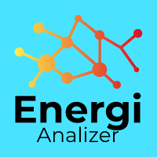

<div align="center">
    
</div>


<div style="text-align: justify;">
    <h4> 
        Energi Analyzer** é um projeto desenvolvido como parte da residência em software organizada pelo CEPEI. Este projeto foi criado para atender ao desafio de Otimização Energética Inteligente na Indústria 4.0, proposto em um hackathon. Nossa equipe escolheu este tema visando criar uma solução eficiente para o monitoramento e manutenção da iluminação pública e privada.
    </h4>
</div>

## Objetivo do Projeto

O Energi Analyzer é uma ferramenta de monitoramento e gestão de lâmpadas em postes de iluminação pública/privada, com foco em otimizar a eficiência energética e o processo de manutenção. Nosso objetivo é garantir que as lâmpadas estejam sempre operando de maneira ideal, minimizando custos, tempo de resposta em caso de falhas e aumentando a eficácia e eficiente na manuntenção.

## Funcionalidades

- **Mapeamento Geográfico**: Registra e organiza todos os postes de iluminação com base em suas coordenadas geográficas, permitindo uma visão geral de cada ponto de luz.
- **Monitoramento Contínuo**: Monitora o status de cada lâmpada em tempo real, identificando rapidamente falhas ou irregularidades.
- **Relatórios Periódicos**: Gera relatórios regulares sobre o desempenho e o estado de cada poste, fornecendo dados para manutenção preditiva.
- **Eficiência na Manutenção**: A plataforma sugere ações de manutenção de acordo com o estado das lâmpadas, garantindo maior precisão e eficiência na reposição ou conserto das lâmpadas defeituosas.


<h2 align="center"> 
    :construction:  Projeto em construção  :construction:
</h2>


### Pré-requisitos

Antes de começar, você vai precisar ter instalado em sua máquina Python 3.10 ou qualquer versão acima. Além disso, é bom ter um editor para trabalhar com o código, como [VSCode](https://code.visualstudio.com/).
Em relação ao banco de dados, sugiro que você trabalhe com o PostgreSQL

### 🎲 Rodando o Back End (servidor)

```bash
# Clone este repositório
$ git clone https://github.com/CaosFera/Energi-Analizer.git

# 1. Acesse a pasta do projeto
$ cd Energi-Analizer

# 2. Crie e ative o ambiente virtual (virtualenv)
$ python -m venv venv
$ source venv/bin/activate  # Linux e Mac
$ venv\Scripts\Activate  # Windows

# 3. Instale as dependências do projeto
$ pip install -r requirements.txt

# 4. Execute as migrações do banco de dados
$ python manage.py migrate

# 5. Crie um superusuário para acessar o admin do Django
$ python manage.py createsuperuser

# 6. Execute o servidor em modo de desenvolvimento
$ python manage.py runserver

# O servidor inciará na porta:8000 - acesse <http://localhost:8000>
🎯 Aqui estão as principais rotas da API:

🔑 Autenticação de Usuários:

    POST /users/login/ Dar acesso ao usuário;
    POST /users/logout/ Desconecta o usuário;
    POST /users/register/company/ Resgistra uma empresa;
    POST /users/register/employee/ Resgistra um funcionário (apenas empresas podem cadastrar funcionários);
```
<div align="center">
    
    
    
</div>


    

🛠️ Tecnologias Utilizadas:
```bash
   ### Backend
- **Django**: [Documentação oficial do Django](https://docs.djangoproject.com/)
- **Django Rest Framework**: [Documentação oficial do Django Rest Framework](https://www.django-rest-framework.org/)

### Banco de Dados
- **PostgreSQL**: [Documentação oficial do PostgreSQL](https://www.postgresql.org/docs/)
- **PostGIS**: Extensão geoespacial para PostgreSQL que permite o trabalho com dados de geolocalização, incluindo suporte para operações espaciais e consultas geográficas. [Documentação oficial do PostGIS](https://postgis.net/documentation/)


### Principais Bibliotecas

- **dj-rest-auth**: [Autenticação de usuários com dj-rest-auth](https://dj-rest-auth.readthedocs.io/)
- **Django**: [Framework web com Django](https://docs.djangoproject.com/)
- **django-allauth**: [Autenticação de usuários com django-allauth](https://docs.allauth.org/)
- **django-filter**: [Criação de filtros com django-filter](https://django-filter.readthedocs.io/)
- **djangorestframework**: [API REST com Django REST Framework](https://www.django-rest-framework.org/)
- **djangorestframework-gis**: [Extensão GIS para Django REST Framework](https://github.com/openwisp/jango-rest-framework-gis)
- **drf-spectacular**: [Documentação de API com DRF Spectacular](https://drf-spectacular.readthedocs.io/)
- **phonenumbers**: [Validação de números de telefone](https://github.com/daviddrysdale/python-phonenumbers)
- **Pillow**: [Gerenciamento de imagens com Pillow](https://pillow.readthedocs.io/)
- **psycopg2-binary**: [Driver PostgreSQL para Python](https://www.psycopg.org/docs/)
- **validate-docbr**: [Validação de documentos brasileiros](https://sambapython.github.io/docbr/)

```